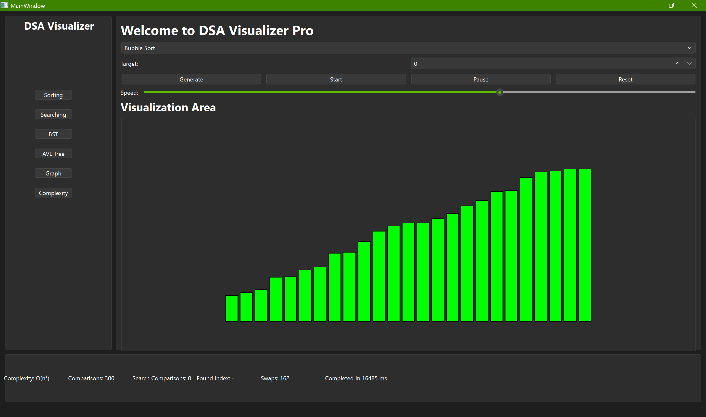
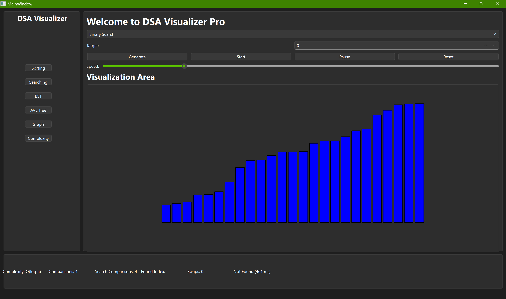
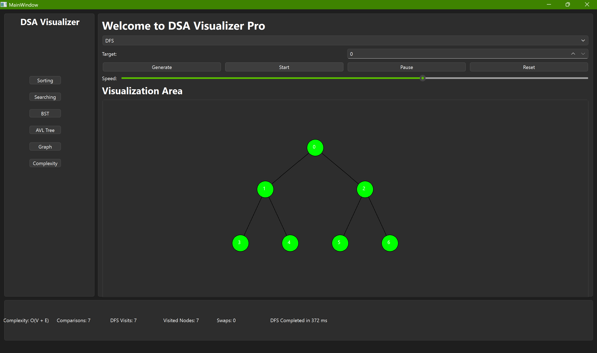
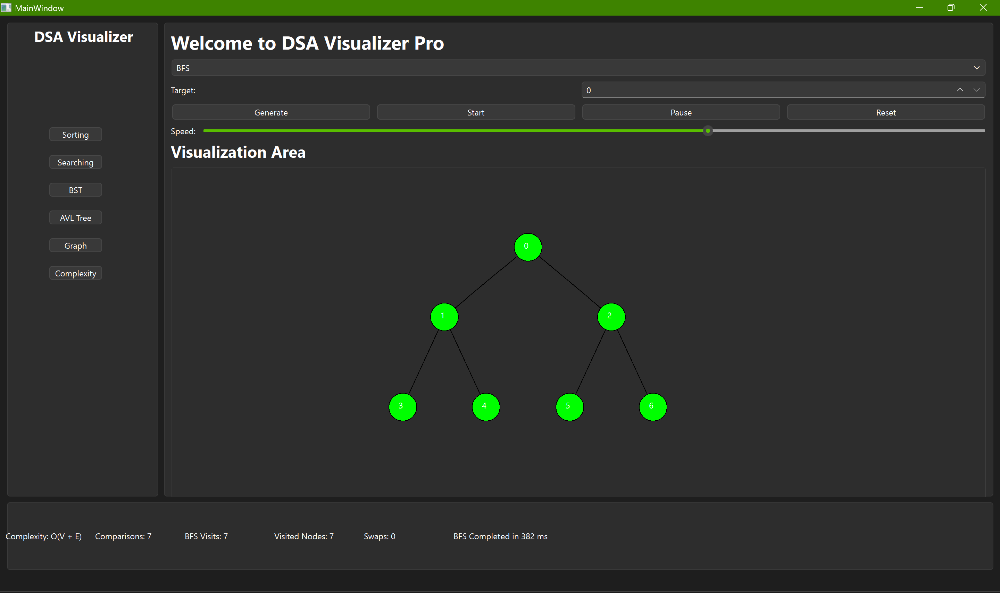
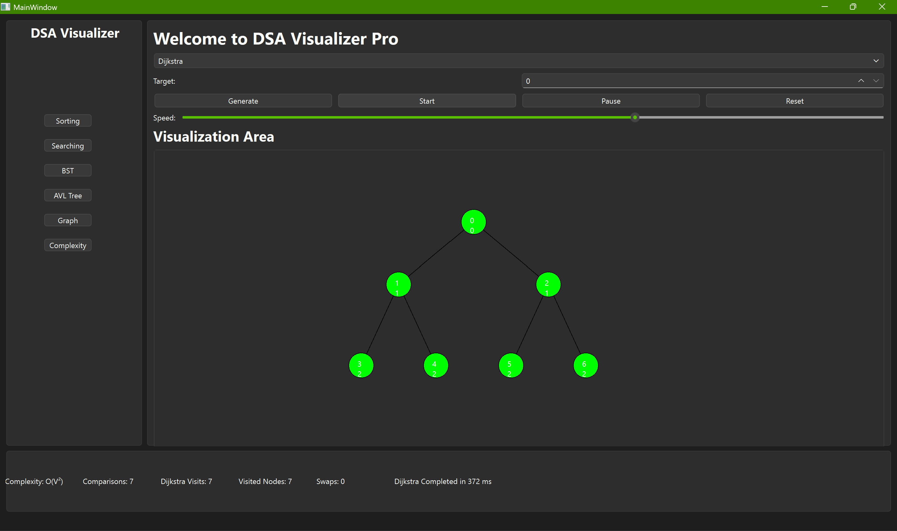
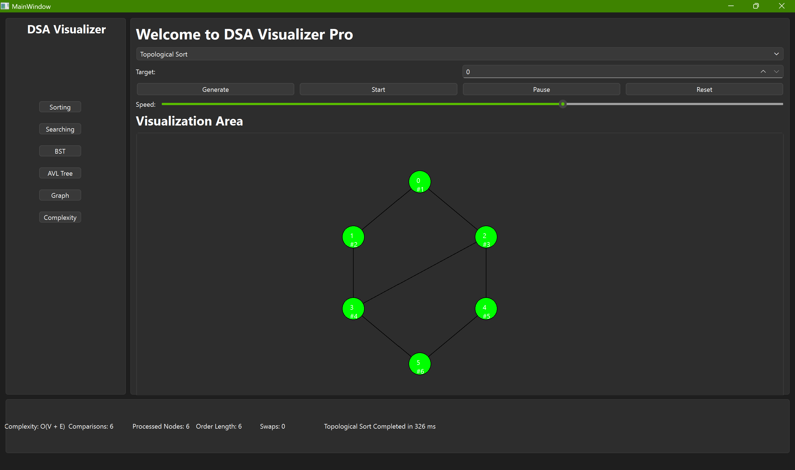

# 🚀 DSA Visualizer Pro

An advanced **Data Structures and Algorithms Visualizer** built using **C++ and Qt Framework** that provides interactive and real-time visualization of fundamental algorithms used in Computer Science. The application helps students, educators, and developers understand algorithm execution through dynamic graphical animations and performance metrics.

---

## 📌 Features

### 🔄 Sorting Algorithms

* Bubble Sort
* Selection Sort
* Insertion Sort
* Merge Sort
* Quick Sort
* Heap Sort

### 🔍 Searching Algorithms

* Linear Search
* Binary Search

### 🌳 Tree Traversals

* Preorder Traversal
* Inorder Traversal
* Postorder Traversal
* Level Order Traversal

### 🌐 Graph Algorithms

* Depth First Search (DFS)
* Breadth First Search (BFS)
* Dijkstra's Shortest Path Algorithm
* Prim's Minimum Spanning Tree
* Kruskal's Minimum Spanning Tree
* Topological Sorting

### 🎨 Visualization Features

* Real-time algorithm animation
* Dynamic graph and tree visualization
* Adjustable execution speed
* Start, Pause, Reset controls
* Random data generation
* Execution time tracking
* Comparison counter
* Swap counter
* Complexity display
* Color-based node and bar highlighting

---

## 🛠️ Technologies Used

| Technology                      | Purpose                      |
| ------------------------------- | ---------------------------- |
| C++                             | Core Logic                   |
| Qt Framework                    | GUI Development              |
| Qt Creator                      | IDE                          |
| CMake                           | Build System                 |
| STL (Standard Template Library) | Data Structures & Algorithms |

---

## 🖥️ User Interface

The application provides an intuitive graphical interface that allows users to:

* Select an algorithm from the dropdown menu
* Generate random input data
* Visualize algorithm execution step-by-step
* Control animation speed
* Monitor performance statistics in real time

---

## 📊 Performance Metrics

The application tracks:

* Number of Comparisons
* Number of Swaps
* Search Comparisons
* Found Index
* Execution Time
* Time Complexity

These metrics help users understand the efficiency of different algorithms.

---

## 📂 Project Structure

```text
DSAVisualizerPro/
│
├── CMakeLists.txt
├── main.cpp
├── mainwindow.cpp
├── mainwindow.h
├── mainwindow.ui
├── sortingvisualizer.cpp
├── sortingvisualizer.h
│
├── Screenshots/
│   ├── bubble_sort.png
│   ├── dfs.png
│   ├── bfs.png
│   ├── tree_traversal.png
│   └── dijkstra.png
│
└── README.md
```

---

## 🚀 Getting Started

### Prerequisites

* Qt 6.x
* Qt Creator
* C++17 or later
* CMake 3.16+

### Installation

1. Clone the repository:

```bash
git clone https://github.com/Raghuvendra30/DSAVisualizerPro.git
```

2. Open the project in Qt Creator.

3. Configure the Qt Kit.

4. Build and Run the project.

---

## 🎯 Learning Objectives

This project was developed to:

* Improve understanding of Data Structures and Algorithms
* Visualize algorithm execution in real time
* Compare algorithm performance
* Demonstrate practical implementation of DSA concepts using C++ and Qt

---

## 📸 Screenshots

### Bubble Sort Visualization


### Binary Search Visualization


### DFS Traversal


### BFS Traversal


### Dijkstra Algorithm


### Topological Sort


---

## 🔮 Future Enhancements

* AVL Tree Visualization
* Binary Search Tree Operations
* Linked List Visualization
* Stack Visualization
* Queue Visualization
* Bellman-Ford Algorithm
* Floyd-Warshall Algorithm
* A* Pathfinding Visualization
* Dark/Light Theme Switching
* Export Statistics Report

---

## 👨‍💻 Author

**Raghuvendra Singh**

* AI & Full Stack Developer
* B.Tech Information Technology
* CCNA Certified
* NVIDIA Certified
* AI Intern @ Marksman Technologies

---

## ⭐ Support

If you found this project useful, consider giving it a ⭐ on GitHub.

Your support motivates further development and improvements.

---

## 📄 License

This project is developed for educational and learning purposes.
Feel free to fork, modify, and learn from the code.
